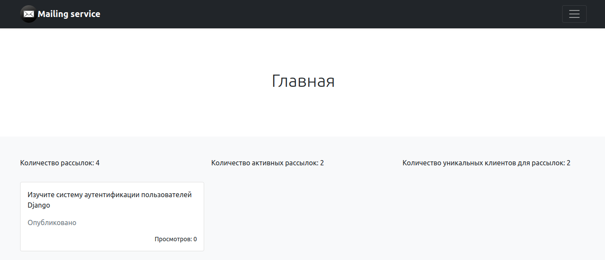

# Сервис рассылок

## Описание

Адаптивный сервис рассылки, который создан с использованием BOOTSTRAP и Django.

База данных - Postgresql

Стек технологий BOOTSTRAP и Django;

С применением ООП (Классы)

## Настройка

Первое, что нужно сделать, это клонировать репозиторий:

    $ git clone https://github.com/gocardless/sample-django-app.git
    $ cd sample-django-app

Создайте виртуальную среду для установки зависимостей и активируйте ее:

    $ virtualenv2 --no-site-packages env
    $ source env/bin/activate

Затем установите зависимости:

    (env)$ pip3 install -r requirements.txt

Обратите внимание на (env)перед подсказкой. Это указывает на то, что этот терминальный сеанс работает в виртуальной среде, настроенной virtualenv2.

После завершения загрузки зависимостей:

    (env)$ cd project
    (env)$ python3 manage.py runserver

И перейдите к http://127.0.0.1:8000/.

